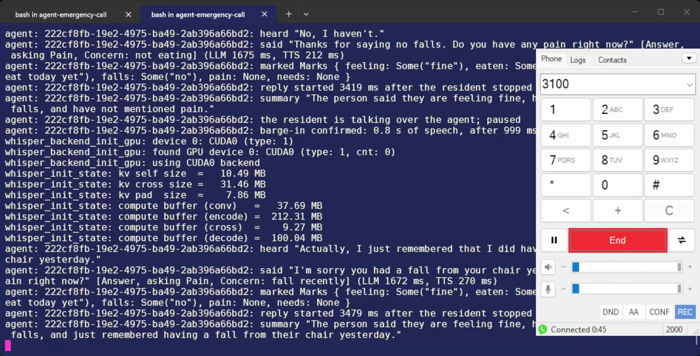
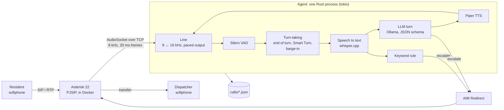

# Are You OK? A voice AI that checks in on people who live alone

**Pick up a phone, dial an extension, and an AI agent holds a short spoken check-in with you:
how you feel, whether you've eaten, whether you've fallen, pain, whether you need anything.
Talk over it and it stops. Pause to think and it waits. Say "I fell and I can't get up" and,
in under a second, it tells you it is connecting you to a person and hands the live call to a
human dispatcher.**

It runs entirely on one laptop, with no cloud, no API keys and no cost: a real phone system
(Asterisk, over SIP), and one Rust process that does the whole call in real time, from speech
recognition and turn-taking to a local LLM, speech synthesis, escalation and logging.


[](demo/first-iteration.mp4)

**[Watch the first-iteration demo](demo/first-iteration.mp4)** (1:31, a live call from a softphone
on the laptop, recorded 2026-09-25). The agent checks in, is talked over and takes a correction
("Actually, I just remembered that I did have a fall"), and hangs up with a concern flag for the
dispatcher. This take has no emergency; [`docs/demo.md`](docs/demo.md) is the full script, transfer
included.

## Why this exists

A daily "are you OK?" call to someone who lives alone is easy to automate as "press 1 if you're
okay", and just as easy to miss something with. This project asks what that call looks like as
a real conversation: one that notices when something is wrong and gets a human on the line,
while staying safe. It is honest about being automated, never gives medical advice, and can
never talk itself out of an escalation.

## Highlights

- **A real phone call, not a web demo.** Softphones register with Asterisk 22 over SIP; the call
  streams to the agent over AudioSocket (8 kHz, 20 ms frames), and an escalation is a live
  transfer through the Asterisk Manager Interface (AMI). Tested on live calls from Linphone on
  an Android phone and a softphone on the laptop, over home Wi-Fi.
- **Turn-taking that behaves like a person.** When the caller talks over the agent, it pauses
  mid-word and gives up the turn if they keep going: in the eval, a caller heard **100 ms** of
  the agent before it stopped, against 1460 ms without barge-in. A "yeah" only pauses it. An
  audio end-of-turn model (Smart Turn v3.2) holds the floor through a hesitant pause, and if the
  agent decides too early it takes the turn back before saying anything.
- **Safety by construction.** Five escalation triggers, none able to suppress another. A keyword
  rule catches "I can't get up" about **0.7 s** after the words, without waiting on the LLM. The
  escalation script is fixed, and no dialled number can leave the PBX.
- **Measured, not vibes.** `make eval` puts 16 scripted callers through the exact code path of a
  live call and fails the run on four safety gates, including near-misses that must *not*
  escalate. All gates pass.
- **Everything local, in one process.** whisper.cpp, Silero VAD and Smart Turn on ONNX Runtime,
  Piper TTS, and a 4B model on Ollama whose output is constrained to a JSON schema. About 7,800
  lines of Rust, with 112 unit tests.
- **Every call is inspectable.** A JSON log per call: transcript, per-turn latency breakdown,
  statuses, barge-ins, the escalation with its trigger and evidence, and a concern flag for the
  dispatcher. It can also save a stereo recording of both sides.

## How a call flows



1. The resident dials **3100**. Asterisk answers and streams the call to the agent.
2. The agent says it is an automated check-in assistant and asks how they are.
3. Every turn: Silero VAD and the turn-taking rules decide when the resident has finished;
   whisper.cpp transcribes; the keyword rule checks the words at once; the LLM writes the next
   turn as a JSON object (status, reason, reply, what the answer covered, whether to end the
   call, a summary); Piper speaks the reply, one 20 ms frame every 20 ms.
4. The agent starts speaking as soon as the `reply` field is written, while the model is still
   writing its summary.
5. On an emergency it stops, says it is connecting them to a person and that they should call
   911 themselves if they are in danger, and transfers the live call to the dispatcher.
6. The call ends with a JSON log, and a mock notice to the dispatcher for anything that needs a
   callback.

## Engineering highlights

**Turn-taking** (`agent/src/conversation.rs`, the `turn` crate). The rules were chosen with a
prototype that replayed 96 labelled pauses through four end-of-turn strategies
([issue #12](https://github.com/qvd808/agent-emergency-call/issues/12)).

- *End of turn:* 1.5 s of silence, held up to 3 s when Smart Turn v3.2, asked 0.2 s into the
  pause, says the turn is unlikely to be over. Smart Turn can only hold the floor, never take
  it, since that was the one direction it was reliable in. Its Whisper log-mel front end is
  ported to Rust and checked against the Python reference.
- *Taking the turn back:* if the resident starts again after the agent has decided they were
  done, but before any reply has played, the LLM call is cancelled and the agent keeps
  listening. A premature decision then costs an LLM call instead of an interruption.
- *Barge-in:* two 32 ms VAD windows of the resident's voice pause the agent's audio mid-word.
  0.8 s of speech, three words or a keyword (stop, wait, help, repeat) gives them the turn;
  otherwise the agent plays on from where it paused. Only speech during a pause is
  transcribed, so the agent never hears its own voice as the resident's.

**Real-time audio** (`agent/src/telephony/`). A telephony seam keeps AudioSocket out of the
conversation core: the core sees 16 kHz frames in, and audio with marks out. The adapter
resamples with a streaming FFT resampler, writes exactly one frame per 20 ms tick (never a
burst), and reports each mark once its audio is on the wire, so the agent always knows what
the resident has actually heard. Whisper, Piper and Smart Turn run on worker threads, so the
task reading a call's frames never blocks.

**Structured, bounded LLM turns** (`agent/src/llm.rs`, `agent/src/checklist.rs`). Ollama
enforces the turn's JSON schema as a grammar, with the fields ordered so the model judges the
status before it writes the reply. The check-in list is kept by the code, not the model, so a
mishearing can't loop the call. Replies that promise anything ("someone will come by") are
caught and rewritten, since nothing can be promised.

## Safety

- **No route out.** The dialplan (`asterisk/config/extensions.conf`) holds only literal internal
  extensions: no patterns, no trunk, no emergency number. The agent refuses to start if the
  dispatcher extension is anything but digits, or is an emergency number.
- **Five escalation triggers, none able to suppress another:**
  1. a keyword rule on every transcript (33 emergency phrases such as "I can't get up", "chest
     pain" and "call 911", plus "help" said on its own), which ignores negation on purpose;
  2. the LLM's `emergency` status, whose own reply is then never spoken;
  3. silence: three prompts in a row unanswered;
  4. the resident asking for a person, or saying yes when offered one instead of medical advice;
  5. an agent fault: the LLM or TTS failing twice, or no reply within 10 s.
- **A fixed escalation script**, synthesised at startup and never written by the LLM, which
  tells the resident to call 911 themselves if they are in danger *before* the transfer.
- **Honest and non-medical.** The agent says it is automated, answers "are you a real person?"
  truthfully, and offers a person instead of medical advice.
- **Synthetic data only.** No real names, recordings or health information anywhere in the repo.

## Results

From `make eval` (16 scripted callers in real time, LLM at temperature 0; run
`2026-09-25T05-06-30Z`), **all four gates pass:**

| Gate | Result |
|---|---|
| Every emergency caller escalates on the turn with the triggering words | 5 of 5 |
| No escalation for ok, mild-concern and near-miss callers ("My neighbour had a fall", "This heat is killing me", "Are you a real person?") | 0 of 9 escalated |
| Mild concern raises a concern flag for the dispatcher | 1 of 1 |
| Keyword escalations never wait on the LLM | script within 725–735 ms |

Turn-taking before and after barge-in, on the same callers (runs `2026-09-25T04-49-15Z`,
`05-06-30Z`, `05-20-34Z`, `05-22-33Z`):

| | Half duplex | Now |
|---|---|---|
| Agent audio heard while the caller says "Sorry, wait, can you say that again?" over it | 1460 ms | 100 ms, then it yields |
| Long pauses where the agent decided too early | 4 of 7, answered over the caller | 3 of 7, none answered: all taken back |

Latency, end of the caller's speech to the agent's first audio: **3.6 s p50, 5.1 s p95**. The
parts, p50: end-of-turn wait 1.5 s, speech to text 0.42 s (overlapping the wait), LLM to the
reply 1.76 s, TTS 0.22 s. On live calls from a phone, replies started 3.2–3.8 s after the
caller stopped (once 4.8 s, when Smart Turn held a finished answer).

## Quick start

You need Linux (developed on Ubuntu under WSL 2), Docker, Rust, `ffmpeg`, and
[Ollama](https://ollama.com). An NVIDIA GPU is optional: with the CUDA toolkit installed
(`/usr/local/cuda/bin/nvcc`), `make` builds whisper.cpp for the GPU and the agent hears with
`large-v3-turbo` instead of `tiny.en`.

```sh
ollama pull qwen3:4b-instruct-2507-q4_K_M
cp .env.example .env
make models          # Silero VAD, whisper tiny.en (+ large-v3-turbo with CUDA), Smart Turn, Piper → models/
make asterisk-build  # Asterisk 22.11.0 from source, in Docker
make eval            # optional: no phone needed; about 17 minutes
```

### Talk to the agent

1. `make asterisk-up`. It generates SIP and AMI secrets into `.env` on the first run, and starts
   Asterisk advertising the laptop's Wi-Fi address.
2. `make sip-accounts` prints what to type into a softphone. Two extensions exist, **1001** and
   **2000**; set up any SIP softphone on the same Wi-Fi (Linphone on a phone, MicroSIP on
   Windows) as one of them:

   | Setting | Value |
   |---|---|
   | Username, password, domain | from `make sip-accounts` |
   | Transport | UDP |
   | STUN, ICE, media encryption | off |
   | Permissions | microphone (and Local Network on iOS) |

   On the same laptop as Docker Desktop, set MicroSIP's Source Port to anything but 5060.
3. `make agent` in a second terminal. It prints every utterance, reply, barge-in and
   escalation as it happens.
4. **Dial 3100** and talk. Escalations go to `DISPATCHER_EXTENSION` in `.env`, so register the
   other extension on a second device to take them.
5. Read the call back in `calls/<call>.json`. With `RECORD_CALLS=on` in `.env` there is also
   `calls/<call>.wav`: you on the left, the agent on the right.
6. `make asterisk-down` when done: while Asterisk runs, anything on the network can send it SIP.

If a speakerphone's echo makes the agent pause on its own voice, use a headset, or set
`BARGE_IN=off`. `make asterisk-cli`, then `pjsip show contacts`, shows which phones are
registered.

## Repository

```
agent/               the live-call agent: one Rust process for the whole call
  src/telephony/     AudioSocket framing, the paced line, AMI transfers
  src/conversation.rs  the turn loop: turn-taking, barge-in, escalation, the call log
  src/escalation.rs  the keyword rule; phrases in data/escalation_phrases.txt
  src/llm.rs         the LLM behind a trait; the prompt in prompts/checkin.txt
turn/                VAD, Smart Turn and the barge-in policy
eval/                make eval: personas, the fake AudioSocket caller, the report
asterisk/            Asterisk 22.11.0 Dockerfile and config
demo/                the first-iteration demo video
docs/                the demo script, research notes, and the knowledge base
```

**How it was built.** Every decision was worked as a ticket on a public
[map issue](https://github.com/qvd808/agent-emergency-call/issues/1): 46 so far, 15 of them
research from primary sources (Asterisk and Ollama source, protocol docs), 4 throwaway
prototypes, and 8 design reviews, each closed with a written resolution. Some of the research
write-ups are in `docs/research/`.

## Limitations and next steps

- **Synthetic callers.** The eval's residents are Piper voices; how the turn-taking holds up for
  real older speakers is the first thing to measure next. Smart Turn, in particular, held four
  finished turns in the eval, which is what raises the p95.
- **Speech to text.** On a laptop CPU only whisper.cpp `tiny.en` is fast enough, and it mishears:
  on live calls it heard one speaker's "fall" as "fault" and "thought". On an NVIDIA GPU the
  agent uses `large-v3-turbo` with a one-line prompt naming the call's topics, which heard those
  words right at a median 353 ms a clip
  ([issue #52](https://github.com/qvd808/agent-emergency-call/issues/52)).
- **Latency.** The 1.5 s end-of-turn wait and the local 4B model's 1.8 s to write a reply make
  up most of the 3.6 s; a faster model and a shorter wait on confident turn ends are the
  levers.
- **Echo.** Barge-in relies on the phone's echo canceller. On the tested phones the agent never
  paused on its own voice, but a speakerphone may; echo cancellation in the agent (WebRTC AEC3)
  is the fix.
- **Inbound only.** Next: scheduled outbound check-ins with retries and missed-check-in alerts,
  bystander voices and line noise in the eval, and telling the model where it was cut off when a
  resident interrupts it.

*All names and scenarios in this repository are fictional.*
